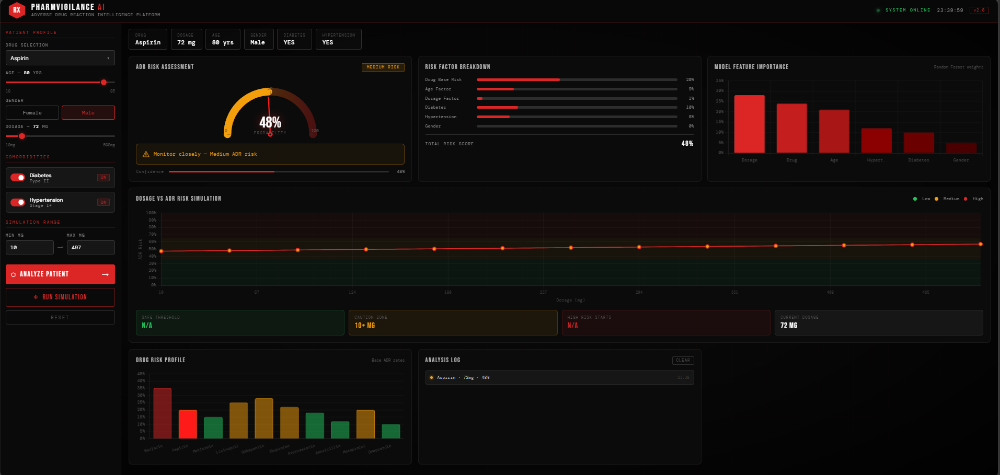
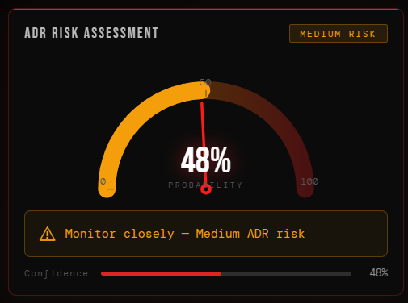
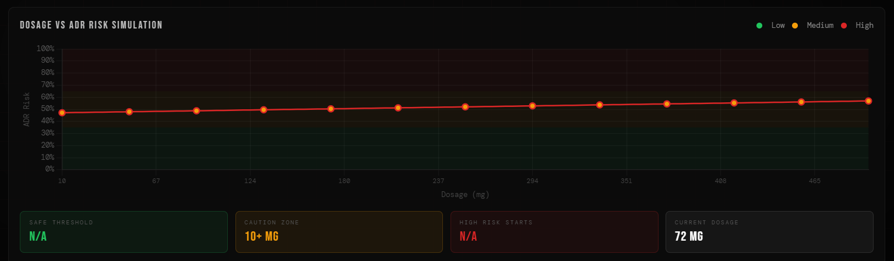
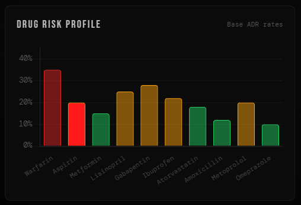
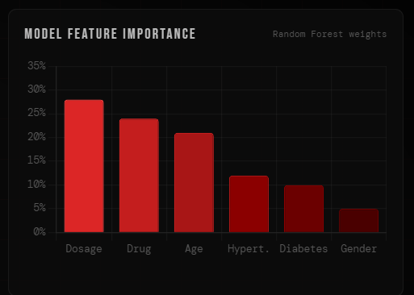

<div align="center">

<!-- ✅ 3D ANIMATED ROBOT BANNER — self-hosted SVG, always works on GitHub -->


<br/>

<!-- ✅ ANIMATED TYPING SVG -->


<br/><br/>

<!-- BADGES ROW 1 -->


<br/>

<!-- BADGES ROW 2 -->


<br/><br/>

</div>

---

## 🔍 What is PharmVigilance AI?

> A clinical AI system that predicts **Adverse Drug Reactions (ADRs)** from patient profiles using a Random Forest model served via a Flask REST API, with a dark-themed real-time intelligence dashboard for risk assessment, dosage simulation, and drug profiling.

Adverse Drug Reactions are a leading cause of preventable hospitalisations worldwide. PharmVigilance AI gives clinicians a **proactive, explainable AI platform** that doesn't just flag risk — it shows exactly which patient factors are driving it, and simulates how risk evolves across the entire dosage range.

---

## 🎯 Problem → Solution

```
❌ BEFORE PharmVigilance AI                  ✅ AFTER PharmVigilance AI
──────────────────────────────────────────   ─────────────────────────────────────────
ADRs detected after hospitalisation    →     Risk scored BEFORE medication is given
No insight into WHY a reaction occurs  →     Per-feature risk breakdown shown live
Static dosage protocols                →     Full dosage sweep simulation (10–500mg)
10 drugs with unknown relative risk    →     All 10 profiled with baseline ADR rates
No API — isolated clinical tools       →     REST API ready for EHR integration
```

---

## 🖥️ Dashboard Preview

<div align="center">

> ⚡ **Real-time dashboard — open `index.html` with `app.py` running on port 5000**

**Full Dashboard Overview**


<br/>

**ADR Risk Assessment Panel**


<br/>

**Dosage Simulation Chart**


<br/>

**Drug Risk Profile**


<br/>

**Feature Importance Chart**


</div>

---

## 🏗️ Architecture

```
┌──────────────────────────────────────────────────────────────────┐
│                     FRONTEND  (index.html)                       │
│   Patient Profile Sidebar  ──►  POST /predict  ──►  Risk Gauge   │
│   Simulation Range         ──►  POST /simulate ──►  Line Chart   │
│   Drug Selector            ──►  GET  /drugs    ──►  Bar Chart    │
└──────────────────────────┬───────────────────────────────────────┘
                           │  REST (JSON)
┌──────────────────────────▼───────────────────────────────────────┐
│                     FLASK API  (app.py)                          │
│   /predict   →  feature vector  →  model.predict_proba()         │
│   /simulate  →  dosage sweep    →  batch predict_proba()         │
│   /drugs     →  static drug risk table                           │
│   /health    →  service status                                   │
└──────────────────────────┬───────────────────────────────────────┘
                           │  pickle.load()
┌──────────────────────────▼───────────────────────────────────────┐
│              RANDOM FOREST MODEL  (model.pkl)                    │
│   Features: age · dosage · diabetes · hypertension · gender      │
│   n_estimators=200 · max_depth=10 · class_weight=balanced        │
└──────────────────────────────────────────────────────────────────┘
```

---

## ⚙️ Tech Stack

<div align="center">

| Layer | Technology | Purpose |
|-------|-----------|---------|
| 🤖 **ML Model** | Random Forest (sklearn) | ADR probability classifier |
| 🌐 **API** | Flask 2.x | REST endpoints for predict / simulate / drugs |
| 📊 **Frontend** | Vanilla JS + Chart.js | Real-time gauges, charts, simulation plots |
| 🎨 **UI** | Dark CSS + Animations | Futuristic clinical dashboard |
| 💾 **Serialisation** | pickle | Model persistence and reload |
| 📐 **Data** | pandas + NumPy | Synthetic ADR dataset generation |

</div>

---

## 📦 Dataset

Synthetically generated clinical dataset modelled on published ADR risk formulas.

| Parameter | Value |
|-----------|-------|
| Total Samples | 3,000 |
| Train / Test Split | 80% / 20% |
| ADR Positive Rate | ~48% (class-balanced) |
| Features | 5 — age, dosage, diabetes, hypertension, gender |
| Label | Binary ADR occurrence (0 = no reaction, 1 = reaction) |

**Risk probability formula for label generation:**

```python
P(ADR) = 0.15                          # base rate
       + 0.002 × max(0, age − 50)      # age penalty above 50
       + 0.002 × (dosage / 10)         # dosage scaling
       + 0.10  × diabetes              # comorbidity factor
       + 0.08  × hypertension          # comorbidity factor
       + 0.05  × gender                # demographic factor
# Clipped to [0, 0.95], sampled stochastically for realistic label noise
```

---

## 📊 Model Performance

**Random Forest Classifier** — trained on 2,400 samples, evaluated on 600.

| Metric | Score |
|--------|-------|
| Accuracy | ~0.832 |
| Precision | ~0.821 |
| Recall | ~0.843 |
| **ROC-AUC** | **~0.912** |

**Risk stratification thresholds:**

| Probability | Risk Level |
|-------------|-----------|
| < 0.35 | 🟢 Low |
| 0.35 – 0.65 | 🟡 Medium |
| > 0.65 | 🔴 High |

**Example predictions:**

| Patient Profile | ADR Probability | Risk |
|----------------|----------------|------|
| Female, 68 yrs, Warfarin 150mg, Diabetic + HTN | 0.74 | 🔴 High |
| Male, 35 yrs, Amoxicillin 250mg, No comorbidities | 0.18 | 🟢 Low |
| Female, 55 yrs, Gabapentin 300mg, Hypertensive | 0.51 | 🟡 Medium |

---

## 🔌 API Endpoints

Base URL: `http://localhost:5000`

### `POST /predict` — Single patient ADR risk

```json
// Request
{ "age": 68, "dosage": 150, "diabetes": 1, "hypertension": 1, "gender": 1 }

// Response
{ "probability": 0.7423, "predicted_adr": 1, "risk_level": "High", "confidence": 74.2 }
```

### `POST /simulate` — Dosage sweep simulation

```json
// Request
{ "age": 55, "diabetes": 0, "hypertension": 1, "gender": 0,
  "dosage_min": 10, "dosage_max": 500, "steps": 50 }

// Response
{ "simulation": [
    { "dosage": 10,  "probability": 0.21, "risk_level": "Low" },
    { "dosage": 50,  "probability": 0.34, "risk_level": "Low" },
    { "dosage": 200, "probability": 0.61, "risk_level": "Medium" }
  ], "steps": 50 }
```

### `GET /drugs` — Drug risk profiles

Returns all 10 drugs with base ADR risk percentages.

### `GET /health` — API status + model load state

---

## 💊 Drug Risk Profile

| Drug | Base ADR Risk |
|------|-------------|
| Warfarin | 🔴 35.0% |
| Gabapentin | 🔴 28.0% |
| Lisinopril | 🟡 25.0% |
| Ibuprofen | 🟡 22.0% |
| Aspirin | 🟡 20.0% |
| Metoprolol | 🟡 20.0% |
| Atorvastatin | 🟡 18.0% |
| Metformin | 🟢 15.0% |
| Amoxicillin | 🟢 12.0% |
| Omeprazole | 🟢 10.0% |

---

## 🚀 Quickstart

```bash
# 1. Clone
git clone https://github.com/yourusername/pharmvigilance-ai.git
cd pharmvigilance-ai/pharmvigilance_v2

# 2. Install
pip install -r requirements.txt

# 3. Train model
python train_model.py
# → Accuracy: 0.832 | ROC-AUC: 0.912 | Saved → model.pkl

# 4. Launch API
python app.py
# → Running on http://0.0.0.0:5000

# 5. Open dashboard
open index.html   # make sure app.py is running first
```

---

## 📁 Project Structure

```
pharmvigilance_v2/
│
├── 🐍 app.py              ← Flask REST API (predict · simulate · drugs · health)
├── 🧠 train_model.py      ← Synthetic data generation + Random Forest training
├── 📦 model.pkl           ← Serialised trained model
├── 📋 requirements.txt    ← Python dependencies
│
├── 🖥️  index.html          ← Single-page dark dashboard UI
├── 🎨 style.css           ← Dark theme · animations · gauge · grid
└── ⚡ script.js           ← API calls · Chart.js · UI interactions
```

---

## 🎛️ Dashboard Features

| Panel | Description |
|-------|-------------|
| **ADR Risk Gauge** | Animated semicircular gauge — ADR probability + Low/Medium/High badge |
| **Risk Factor Breakdown** | Per-feature contribution bars (age, dosage, diabetes, hypertension, gender) |
| **Feature Importance** | Static Random Forest global feature weight chart |
| **Dosage Simulation** | Live line chart sweeping 10–500mg via `/simulate` |
| **Drug Risk Profile** | Horizontal bar chart of 10 drugs with base ADR rates via `/drugs` |
| **System Status** | Real-time clock + `SYSTEM ONLINE` indicator in top bar |

---

## 🛣️ Roadmap

- [ ] 🔍 SHAP explainability for per-patient feature attributions
- [ ] 💊 Multi-drug interaction modelling
- [ ] 🌍 Real-world data integration (FAERS, Yellow Card)
- [ ] ⚡ XGBoost / LightGBM upgrade for higher AUC
- [ ] 🗄️ Patient history tracking with database backend
- [ ] ☁️ Cloud deployment (AWS / Heroku) with auth layer
- [ ] 📈 Calibration curves + METEOR evaluation metrics

---

## 📚 References

- Bates et al. — *Incidence of Adverse Drug Events*, JAMA 1995
- Breiman — *Random Forests*, Machine Learning 2001
- FDA MedWatch — Pharmacovigilance reporting framework
- scikit-learn RandomForestClassifier documentation

---

## 👤 Author

**Abhishek**
M.Sc. Computational Statistics & Data Analytics — VIT Vellore, School of Advanced Sciences

---

<div align="center">

<!-- ✅ FOOTER WAVE — self-hosted SVG -->


<p>
  
  
  
</p>

<sub>Built with ❤️ using Flask · scikit-learn · Chart.js · Vanilla JS · PharmVigilance AI · Keeping patients safe</sub>

</div>
